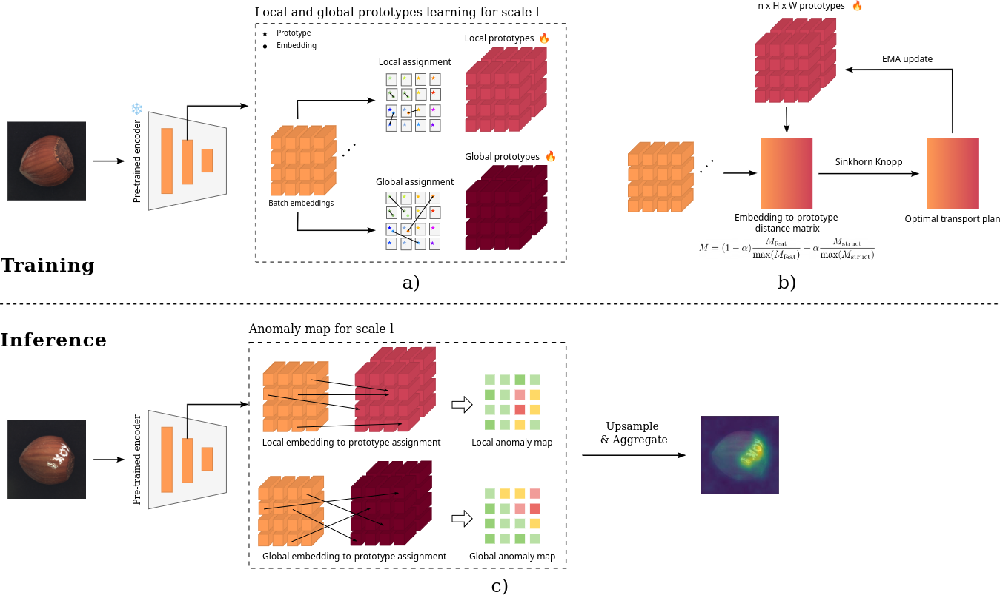
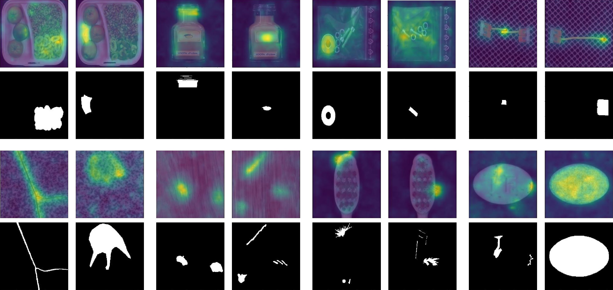

# PRADOT : Prototype-based Anomaly Detection with Optimal Transport

This repo is the official Pytorch implementation of the papier *Learning local and global prototypes with optimal transport for unsupervised anomaly detection and localization* accepted at the International Workshop on Learning from Small Data 2025 (ECML Workshop). [[paper]](https://arxiv.org/abs/2508.12927)



&nbsp;

## Installation

The code has been developped and tested with Python=3.10.13, Numpy=1.26.4, Pytorch=2.2.0, Lightning=2.3.3 and POT=0.9.5.

To install the package, you should first clone this repo with:
```
git clone https://github.com/robintrmbtt/pradot.git
```

Then, you can install all the dependencies to run the code with the following commands:
```
conda create -n pradot python=3.10 numpy=1.26.4 -y
conda activate pradot
pip install torch==2.2.1 torchvision==0.17.1 torchaudio==2.2.1 --index-url https://download.pytorch.org/whl/cu121

cd pradot
pip install -r requirements.txt
```
Additionally, you should set the following environment variables (if you don't you'll need to modify the configuration file):
```
export pradot_mvtecad="/path/to/mvecad/data"
export pradot_mvtecad_loco="/path/to/mvtecad_loco/data"
export pradot_results="/path/to/save/folder"
```

## Usage

### Training and test

The code uses Hydra and Lightning for the training and evaluation. You can run both as follows:
```
python pradot/train.py +task=mvtecad_loco
```

where the parameter ```+task``` is required and can be set to ```mvtecad``` or ```mvtedad_loco```.

By default, the evaluation computes all the graphs shown in the article, that is, performance metrics, embedding-to-prototype assignments, prototype reconstruction, image recontruction and UMAP projection. You can modify this behaviour in the ```task``` parameter of the configuration.

### Configuration

With Hydra, you can overwrites any parameter of the default configuration file. For instance, you can change the parameter $\alpha$ and the number of prototypes:

```
python pradot/train.py +task=mvtecad data.obj=carpet model.alpha=0.2 model.encoder.nb_proto=4
```

Check the configuration files in the ```config/``` to see what are the options you can play with.

### Ensembling

With this implementation, it is possible to run a multi-scale model, for instance by setting ```model.out_indices=[2,3]``` in the configuration file, but it is not possible to use multiple values of $\alpha$. The file ```pradot/ensemble_experiments.py``` allows to ensemble the predictions of multiple experiements and compute the performance of the aggregated model. 
To reproduce the performance of the final PRADOT model, you should first train four models with the following parameters: $(\text{out ind}, \alpha) = (2, 0); (2, 0.3); (3, 0.3); (3, 0.3)$. Then, you can ensemble their predictions with:

```
python pradot/ensemble_experiements.py /path/to/save/folder --exp_path /path/to/exp/out_ind=2_alpha=0 /path/to/exp/out_ind=2_alpha=0. /path/to/exp/out_ind=2_alpha=0.3 /path/to/exp/out_ind=3_alpha=0 /path/to/exp/out_ind=3_alpha=0.3
```

&nbsp;

## Results

### MVTec AD LOCO
|                | Classification (AU-ROC) | Localization (AU-sPRO) |
|:--------------:|:--------------:|:------------:|
| Breakfast box  | 81.6 | 56.9  |
| Juice bottle   | 89.7 | 68.9  |
| Pushpins       | 73.0 | 39.0  |
| Screw bag      | 70.5 | 44.4  |
| Connectors     | 79.6 | 53.9  |
| **Mean**           | **78.9** | **52.6**  |

### MVTec AD
|                | Classification (AU-ROC) | Localization (AU-ROC) |
|:--------------:|:--------------:|:------------:|
| Carpet    | 99.9 | 99.2  |
| Grid      | 96.2 | 97.5  |
| Leather   | 100.0| 99.3  |
| Tile      | 100.0| 95.7  |
| Wood      | 99.0 | 94.6  |
| Bottle    | 100.0| 98.5  |
| Cable     | 99.1 | 98.4  |
| Capsule   | 93.4 | 98.4  |
| Hazelnut  | 100.0| 98.9  |
| Metal     | 100.0| 96.9  |
| Pill      | 95.7 | 97.2  |
| Screw     | 91.0 | 97.9  |
| Toothbrush| 88.3 | 98.6  |
| Transistor| 99.3 | 96.2  |
| Zipper    | 97.2 | 96.8  |
| **Mean**           | **97.3** | **97.6**  |



&nbsp;

## Reproducibility

We provide in the ```scipts/``` folder all the commands used to run the experiments presented in the paper, including the ablation studies. All the experiments were launched on 32 GB NVIDIA V100 GPUs.
